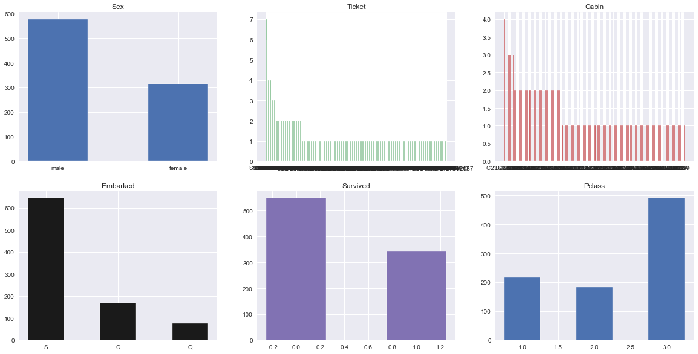
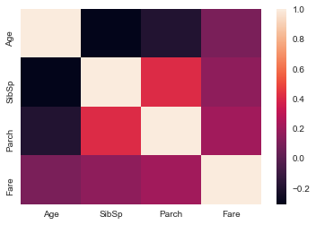
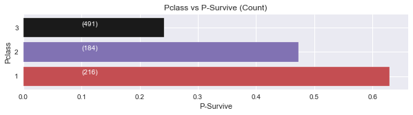
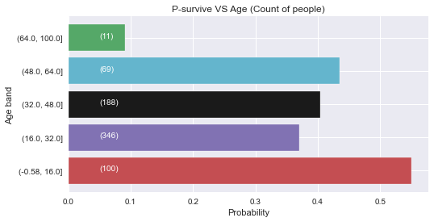
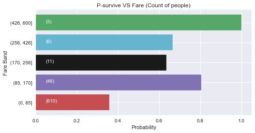
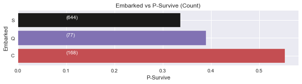

# TITANIC KAGGLE - Competitions
This is Titanic Survivors Classifications for Kaggle Competitions

# Background
Understand the relationship between the circuntances and the outcome, that finished the life of 549 human lifes. What characterized to the people, why they survived and what factors pushed his probabilities to survive are the main question that i going to review in this notebook.

## Project Planning

* Understand the data behavior 

  1.0 Histograms

  
  1.1 Barchars 

  
  2 Value counts 

  3 Missing data

  4 correlations of some features

  
* Explore interesting themes 

  1 Rich people survive more?

  

  1 Young people survive more? 

  

  2 Female survive more?, what about kids and old people

  

  3 How the fare payment affects the survival

   

  4 Your title name affects your chances to survive

|title_Name|  Miss |  Mr | Mrs  |Others|
|----------|-------|-----|------|------|
|Survived |      |        |      |     |
|0        |            55  |436  | 26     | 32|
|1        |          127  | 81  | 99     | 3|

  5 Where did you embarked affects your chance to survive

  

  6 Be alone affects your chance to survive ¿? 

  7 The quantity of cabin that was bought per passenger affects the survival ¿?

* Feature Engineering
    * Create more features
    * Fill nan values
    * Normalize data
    * Try to categorize data and see what happened ¿is good?
* Preprocess data for numerical and categorical data
* Understand the limitations of the data – imbalance data
* Model tunning
* Model benchmark

| Model  | score  | 
|---|---|
| SVC  |    0.872 |  
| XGB  | 0.874 | 
| KNC  |   0.9068|
| Voting All| 0.9023| 

